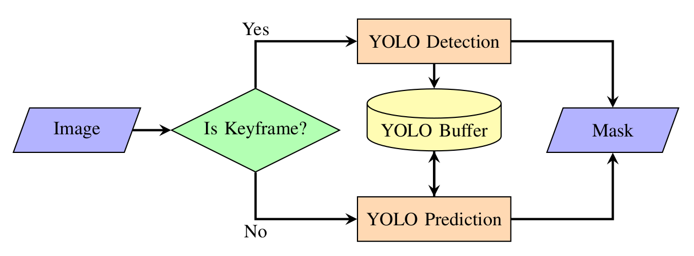
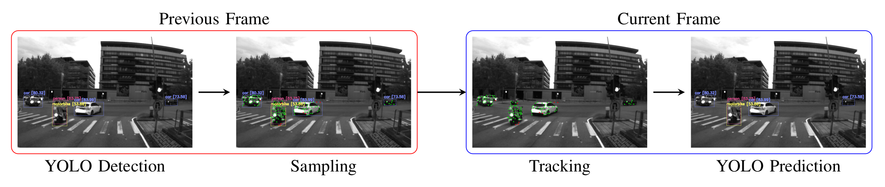

# YVINS-Fusion

## A Fast YOLO-based Visual Pipeline for VIO in Dynamic Environments

Based on [VINS-Fusion](https://github.com/HKUST-Aerial-Robotics/VINS-Fusion)

### ⚡ Key Features

We propose a fast YOLO-based visual pipeline for VINS-Fusion. The pipeline is designed to be lightweight and efficient, making it suitable for real-time applications on CPU-only devices. 
The key features of our pipeline include:

- **Keyframe Yolo Detection**:
<!-- set image size -->

<!--  -->

  

- **Yolo Prediction Mechanism**(for non-keyframe):

<!--  -->
  

## 1. Prerequisites

### 1.1 **Ubuntu** and **ROS**

Ubuntu 64-bit 20.04
ROS Noetic. [ROS Installation](http://wiki.ros.org/ROS/Installation)

### 1.2. **Ceres Solver**

Follow [Ceres Installation](http://ceres-solver.org/installation.html).

## 2. Build YVINS-Fusion

Clone the repository and catkin_make:

```bash
cd ~/catkin_ws/src
git clone https://github.com/nlc2002/YVINS-Fusion.git
cd ../
catkin_make
source ~/catkin_ws/devel/setup.bash
```

(if you fail in this step, try to find another computer with clean system or reinstall Ubuntu and ROS)

## 3. Run YVINS-Fusion

### 3.1 Campus dataset

[download](https://cloud.tsinghua.edu.cn/f/c93294680f2544b0a094/?dl=1)

Run the following command to play the bag file:

```bash
roslaunch vins vins_zed2i_mono.launch 
rosbag play campus.bag
```

### 3.2 [KAIST](https://sites.google.com/view/complex-urban-dataset)

*/datas/global_pose.py* transfer the global pose.csv to rosbag. Then you can merge the global_pose.bag with needed bag files. Here we provide a sample bag file ([urban27-dongtan](https://cloud.tsinghua.edu.cn/d/b67c9db499e84efb96f6/)) with global pose embedded.  

After downloading the dataset, run the following command to extract the bag file:

```bash
cat urban27-dongtan.tar.gz** | tar -xzv
```

Then you can run the following command to play the bag file:

```bash
roslaunch vins vins_kaist39_mono.launch 
rosbag play urban27-dongtan-gt.bag
```

A video of the result is available [here](https://www.youtube.com/watch?v=Wm_2r3Ow2kA).

### 3.3 Configuration file

Write a config file for your device. You can take config files of KAIST as the example. 

## 4. Acknowledgements

We use [ceres solver](http://ceres-solver.org/) for non-linear optimization and [DBoW2](https://github.com/dorian3d/DBoW2) for loop detection, a generic [camera model](https://github.com/hengli/camodocal) and [GeographicLib](https://geographiclib.sourceforge.io/).

We use [Yolo-Fastest](https://github.com/dog-qiuqiu/Yolo-Fastest/tree/v.1.1.0) as Yolo detector.

## 5. License

The source code is released under [GPLv3](http://www.gnu.org/licenses/) license.
